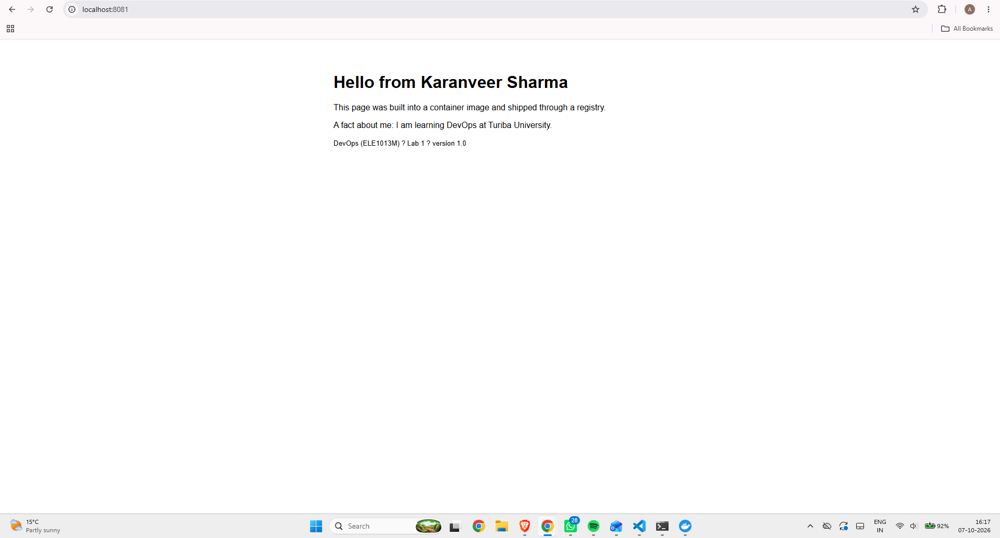

# Lab 1 · Ship it

- **Image:** `ghcr.io/abhirajdhingrax/lab1-web:1.0`
- **Digest:** `sha256:5649c346a7884b8fc2d05ce4e662298ee1869c9f2c9b88bfec90e62cb4ea71d9`
- **Platforms:** linux/amd64, linux/arm64
- **Partner's image I ran:** `ghcr.io/ikaran34/lab1-web:1.0` (digest matched: yes)



## Answers

1. **Where does the kernel used by your containers come from on your laptop?**
   My laptop runs Windows, so the Linux kernel comes from the WSL 2 virtual machine that Docker Desktop uses. All containers share this one kernel: Alpine and Ubuntu containers print the same kernel version, but different distributions.

```
Docker Desktop (containerized) | kernel 6.18.40.1-microsoft-standard-WSL2 | x86_64
alpine: 6.18.40.1-microsoft-standard-WSL2
ubuntu: 6.18.40.1-microsoft-standard-WSL2
```

2. **What is the difference between `lab1-web:1.0` and `mypage`?**
   `lab1-web:1.0` is the image: a read-only template I built from the Dockerfile. `mypage` is a container: a running instance created from that image. One image can be used to start many containers.

3. **In Part 2 your edit to `index.html` survived `docker stop` but not `docker rm`. Why?**
   My edit was saved in the container's writable layer. `docker stop` only stops the container and keeps that layer, so the edit was still there after `docker start`. `docker rm` deletes the container together with its writable layer. The new container started fresh from the unchanged nginx image.

4. **Your page is about 1 KB, the image is tens of MB. What do you think the rest is?**
   The rest comes from the base image in the `FROM` line: Alpine Linux and nginx with its libraries and config files. My image (about 93 MB on disk, 26 MB compressed) contains all the layers of `nginx:stable-alpine` plus one small layer with my `index.html`.
